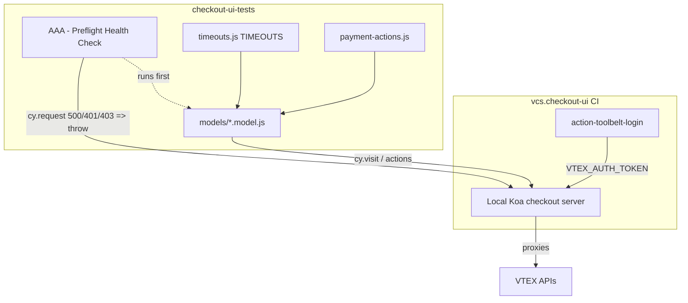

# Update & Harden the Checkout UI E2E Suite (PEXP-1711)

> **Status**: Draft
> **Created**: 2026-07-10

## 1. Business Context

### Problem Statement
 
The `checkout-ui-tests` Cypress suite is the E2E safety net for VTEX
SmartCheckout (`vcs.checkout-ui`). It had degraded into an unreliable signal:

- **Runs looped overtime.** Generous per-command timeouts (`pageLoadTimeout`
  180s, submit-button 30s) combined with `retries.runMode: 2` meant a single
  genuinely-broken live flow re-ran its full ~90s setup three times before
  failing, burning CI minutes and delaying the panel result.
- **Auth failures produced opaque errors.** When `VTEX_AUTH_TOKEN` is empty in CI
  (the token exported by `vtex/action-toolbelt-login`, which can silently emit an
  empty value via the deprecated `set-output`), the local checkout server returns
  500/401/403 and *every* spec fails in `before each` on `cy.visit()` with no clue
  as to the real cause.
- **Dead and duplicated tests added noise.** Skipped models for discontinued /
  never-implemented features (Redirect, Google Pay, Expired card) and
  fully-skipped duplicated Scheduled Delivery models remained in the tree with
  their per-account wrappers, inflating the suite and confusing maintainers.
- **Two real flows were broken.** The pickup-only credit-card scenario never
  filled the billing address (no shipping address exists to prefill it), and the
  post-payment-error re-submit timed out because the submit button is briefly
  hidden/disabled during error recovery.

The affected parties are the Checkout engineering team (who rely on the panel to
gate releases) and on-call (who triage red runs). Left unsolved, the suite keeps
flapping red for environmental/known reasons, eroding trust until failures are
ignored — defeating the point of the safety net.

### Goals

- A stuck page/checkout/request **fails fast** (bounded wall-clock) instead of
  looping overtime; all bounds remain env-tunable to restore prior behavior.
- An empty/invalid `VTEX_AUTH_TOKEN` yields **one actionable failure** at the top
  of the run rather than N generic 500s.
- The suite contains **no dead or duplicated skipped** models/wrappers.
- The **pickup-only credit-card** and **post-error re-submit** scenarios pass
  reliably (or fail for genuine product reasons, not test-harness gaps).
- No reduction of genuine coverage: only dead/duplicate tests are removed; live
  scenarios keep their strict assertions.

### User Stories

#### US-1: Fail fast on stuck runs

- **Story**: As a Checkout engineer, I want a broken live flow to fail within a
  bounded time, so that CI returns a result quickly instead of looping overtime.
- **Acceptance Criteria**:
  - **Given** a checkout page that never finishes loading, **when** the suite
    runs, **then** the spec fails at `pageLoadTimeout` (default 90s) rather than
    180s.
  - **Given** a genuinely failing flow, **when** it fails, **then** it re-runs at
    most once (`retries.runMode: 1`), not twice.
  - **Given** a need to restore prior behavior, **when** an operator sets an env
    override (e.g. `CYPRESS_RETRIES`, `submitButton`), **then** the new value
    takes effect without code changes.

#### US-2: Actionable auth failure

- **Story**: As an on-call engineer, I want a single clear message when auth is
  broken, so that I don't have to diff N identical 500s to find the root cause.
- **Acceptance Criteria**:
  - **Given** the checkout server returns 500/401/403, **when** the suite runs,
    **then** the pre-flight spec runs first and fails with a message naming the
    likely empty `VTEX_AUTH_TOKEN` and the login step to check.
  - **Given** the server responds 200/204, **when** the pre-flight spec runs,
    **then** it passes and the rest of the suite proceeds.

#### US-3: Clean suite

- **Story**: As a maintainer, I want dead and duplicated skipped tests removed,
  so that the tree reflects only live, meaningful coverage.
- **Acceptance Criteria**:
  - **Given** a skipped model for a discontinued/unimplemented feature, **when**
    the cleanup is done, **then** the model and all its per-account wrappers are
    deleted and no dangling imports remain.
  - **Given** a duplicated fully-skipped model, **when** the cleanup is done,
    **then** only the removal is applied — no live scenario loses coverage.

#### US-4: Pickup-only billing address

- **Story**: As a shopper buying pickup-only items with a credit card, I want the
  test to fill the billing address, so that the scenario reflects real checkout
  and reaches order placement.
- **Acceptance Criteria**:
  - **Given** a pickup-only cart on a non-invoice account, **when** paying by
    credit card, **then** the test selects Brasil and fills
    street/neighborhood/number before submitting and reaches `/orderPlaced`.
  - **Given** an invoice account, **when** paying, **then** billing is inherited
    from the invoice address and the manual fill is skipped.

#### US-5: Post-error re-submit

- **Story**: As a Checkout engineer, I want the "validate form fields after
  error" test to re-submit reliably, so that it asserts the validation message
  instead of timing out on a gated button.
- **Acceptance Criteria**:
  - **Given** a declined payment whose modal was dismissed and the CVV cleared,
    **when** the test re-submits with the force option, **then** the click fires
    and `Campo obrigatório` is asserted.
  - **Given** any non-error (happy-path) submit, **when** it runs, **then** it
    still uses the strict visible+enabled check (force is opt-in only).

### Key Scenarios

| Scenario | Pre-conditions | Steps | Expected Result |
|---|---|---|---|
| Pre-flight OK (happy path) | Valid `VTEX_AUTH_TOKEN`, server healthy | Run suite | `AAA - Preflight Health Check` passes; suite proceeds |
| Empty auth token (error case) | `VTEX_AUTH_TOKEN` empty → server 500/401/403 | Run suite | Pre-flight fails first with actionable auth message; no N opaque 500s |
| Pickup-only credit card (happy path) | Non-invoice account, pickup-only cart | Pickup → payment → fill billing (Brasil + street/neighborhood/number) → submit | Reaches `/orderPlaced` with pickup + card summary |
| Post-error re-submit (edge case) | Payment declined, modal dismissed, CVV cleared | `completePurchase({ force: true })` | Forced click fires; `Campo obrigatório` visible |
| Stuck checkout (error case) | Checkout hangs on "finalizing" | Run affected spec | Fails at bounded `SUBMIT_BUTTON`/`pageLoadTimeout`, retried at most once |

### Functional Requirements

- FR-1: Centralize payment/orderPlaced/setup waits in a single env-tunable module.
- FR-2: Reduce `retries.runMode` to 1 and trim page-load/submit/request timeouts,
  all overridable via `Cypress.env`.
- FR-3: Add a first-running pre-flight spec that classifies 500/401/403 as an
  auth failure with an actionable message and passes on 200/204.
- FR-4: Delete dead-code and duplicated skipped models plus every matching
  per-account wrapper, leaving no dangling imports.
- FR-5: Extend `fillBillingAddress` to support the `country` and `neighborhood`
  billing fields; default billing country to `BRA`.
- FR-6: Fill the full billing address for the pickup-only credit-card model on
  non-invoice accounts.
- FR-7: Add an opt-in `force` mode to `completePurchase` for post-error re-submit;
  keep the strict path as default.

### Non-Functional Requirements

- **Determinism**: Changes must not increase flakiness; live scenarios keep
  strict assertions.
- **Tunability**: Every timeout/retry bound must be overridable via env without
  code edits.
- **Discoverability**: The pre-flight spec must match `specPattern`
  (`tests/**/*.test.{js,ts}`) and sort first (the `AAA` prefix).
- **Compatibility**: Node ≥ 14, Cypress 10.11.x, `eslint-config-vtex`; no new
  runtime dependencies.
- **Backward behavior**: Prior timeout/retry values restorable via env overrides.

### Out of Scope

- Fixing the empty `VTEX_AUTH_TOKEN` in `vcs.checkout-ui` CI (owned by infra —
  the pre-flight only *diagnoses* it; CI stays red until infra restores auth).
- Fixing the underlying Checkout app defect (Bootstrap 2.3.2 `enforceFocus` /
  jQuery 1.8.3 `RangeError` on modal close); tests only work around/quarantine it.
- Migrating Cypress, the test framework, or the package manager.
- Re-architecting account multiplication or consolidating `shipping-preview`
  coverage (captured as open decisions in `docs/test-dedup-analysis.md`).

---

## 2. Arch Decisions

### Proposed Solution

Harden the existing suite in place — no framework or structural migration:

1. **Timeouts module** (`utils/timeouts.js`): a `TIMEOUTS` object exposing
   `SUBMIT_BUTTON` (20s), `PAYMENT_PROCESSING` (120s, unchanged), and
   `RUNTIME_CONTEXT` (60s) via getters that read `Cypress.env(...)` at call time.
   Models replace scattered `timeout: 120000` literals with these constants.
2. **Config bounds** (`cypress.config.ts`): `retries.runMode` 2 → 1;
   `pageLoadTimeout` 180s → 90s; add `requestTimeout`/`responseTimeout`; all
   env-tunable.
3. **Pre-flight spec** (`tests/AAA - Preflight Health Check.test.js`): a single
   `cy.request({ failOnStatusCode: false })` against the checkout endpoint that
   throws an actionable error on 500/401/403 and passes on 200/204.
4. **Dead/duplicate removal**: delete confirmed-skipped models + wrappers; verify
   no dangling imports; document in `docs/test-dedup-analysis.md`.
5. **Billing/payment helpers** (`utils/payment-actions.js`): extend
   `fillBillingAddress` (add `country`, `neighborhood`; order country first),
   default billing country `BRA`, add `completePurchase({ force })`, and add JSDoc
   types to iframe helpers.

### Architecture Overview



### Alternatives Considered

| Alternative | Pros | Cons | Verdict |
|---|---|---|---|
| Fix empty `VTEX_AUTH_TOKEN` in `vcs.checkout-ui` workflow | Fixes root cause | Out of team ownership; explicitly excluded by stakeholder | Rejected — diagnose only |
| Global Mocha test timeout instead of per-command | One knob | Cypress disables Mocha wall-clock timeout; only per-command + retries bound duration | Rejected (ineffective) |
| Swallow the `RangeError` via `Cypress.on('uncaught:exception')` | Quick | App still frozen on "finalizing"; button stays hidden — doesn't unblock | Rejected |
| Make `completePurchase` lenient for all callers | Simplest diff | Removes safety net; happy-path regressions would be force-clicked silently | Rejected — opt-in `force` only |
| Keep dead/duplicate skipped tests | Zero effort | Perpetuates noise and maintenance drag | Rejected |

### Risks & Mitigations

| Risk | Impact | Likelihood | Mitigation |
|---|---|---|---|
| Trimmed timeouts cause false negatives on slow gateways | Med | Med | Kept `PAYMENT_PROCESSING` at 120s; all bounds env-tunable to restore |
| Inferred billing iframe selectors (`country`/`neighborhood`) wrong | Med | Med | Follow existing `#payment-billing-address-<field>-<id>` convention; verify via `cypress open` |
| `force` re-submit clicks a genuinely disabled button (no validation shown) | Med | Low | If button is truly `display:none`, fall back to asserting disabled state instead of clicking |
| Wrapper deletion removes an active test by substring match | High | Low | Confirm each model is `describe.skip`/`it.skip` and match exact import string before deleting |
| Stray artifacts (`cypress/screenshots copy/`, `utils/Untitled`) committed | Low | Med | Exclude from staging; only `docs/` + pre-flight spec are intentional new files |

### Key Decisions

#### Decision 1: Diagnose auth in the tests repo, don't fix CI

- **Status**: Accepted
- **Context**: Empty `VTEX_AUTH_TOKEN` originates in `vcs.checkout-ui` CI, owned by infra.
- **Decision**: Add a pre-flight spec that turns the opaque 500 wall into one
  actionable message; do not modify `vcs.checkout-ui`.
- **Consequences**: Faster triage; CI still red until infra restores a valid token.

#### Decision 2: Env-tunable per-command timeouts over a global timeout

- **Status**: Accepted
- **Context**: Cypress bounds duration via per-command timeouts + retries, not a
  Mocha wall-clock timeout.
- **Decision**: Centralize per-command waits in `TIMEOUTS` getters reading
  `Cypress.env` at call time; trim defaults; keep them overridable.
- **Consequences**: Fast-fail by default, reversible per environment; models must
  import the constants.

#### Decision 3: `force` is opt-in on `completePurchase`

- **Status**: Accepted
- **Context**: Only the post-decline re-submit hits a briefly-gated button.
- **Decision**: Add `completePurchase({ force = false })`; force drops
  `:visible`/`be.enabled` and force-clicks; strict remains default.
- **Consequences**: One line changes in the error model; all other callers keep
  the safety net.

#### Decision 4: Remove only confirmed dead/duplicate skipped tests

- **Status**: Accepted
- **Context**: Suite carried skipped models for discontinued features and
  duplicated Scheduled Delivery models.
- **Decision**: Delete only confirmed-skipped models + exact wrappers; document
  removals and defer account-multiplication / shipping-preview consolidation.
- **Consequences**: Leaner tree, no live coverage lost; larger consolidation left
  as an explicit team decision.

### Implementation Plan

1. Add `utils/timeouts.js`; migrate `timeout: 120000` literals across models.
2. Tighten `cypress.config.ts` (retries, page-load, request/response), env-tunable.
3. Add the pre-flight health-check spec.
4. Remove dead/duplicate models + wrappers; grep for dangling imports; add
   `docs/test-dedup-analysis.md`.
5. Extend `fillBillingAddress`, default `BRA`, add `completePurchase({ force })`,
   JSDoc the iframe helpers; apply to the pickup-only and error-recovery models.
6. `yarn lint`; verify the two fixed scenarios via `cypress open`.
7. Update `CHANGELOG.md` (Unreleased) and open the PR (exclude stray artifacts).

---

## 3. Technical Contract

### Data Models

No persistent data models. Test-config value objects only:

- `TIMEOUTS` — `{ SUBMIT_BUTTON: number, PAYMENT_PROCESSING: number, RUNTIME_CONTEXT: number }`,
  each a getter resolving `Cypress.env(key)` at call time with a coded fallback.
- `fillBillingAddress` options — `{ id?: string, country?: string, postalCode?: string, street?: string, neighborhood?: string, number?: string, city?: string }` (all optional; `country` selected before other fields).
- `completePurchase` options — `{ force?: boolean }` (default `false`).

### Interfaces

`utils/payment-actions.js` (module boundary consumed by models):

```js
// Strict by default; force bypasses visible/enabled actionability for post-error re-submit.
export function completePurchase({ force = false } = {}) {}

// country & neighborhood added; country is selected first (re-renders the form).
export function fillBillingAddress(options) {}

// Billing country defaults to 'BRA'; forwarded into fillBillingAddress.
export function payWithCreditCard(options = { withAddress: false }) {}
```

`utils/timeouts.js`:

```js
export const TIMEOUTS = {
  get SUBMIT_BUTTON() {},      // default 20000, env: submitButton
  get PAYMENT_PROCESSING() {}, // default 120000, env: paymentProcessing
  get RUNTIME_CONTEXT() {},    // default 60000, env: runtimeContext
}
```

Pre-flight spec contract: for account `Accounts.DEFAULT`, `cy.request({ url:
getBaseURL(...) + CHECKOUT_ENDPOINT, failOnStatusCode: false })` → throw on
`[500,401,403]` (actionable auth message), throw on non-`[200,204]` (generic),
pass otherwise.

### Integration Points

- **Local Koa checkout server** (`vcs.checkout-ui`) — target of `cy.visit` /
  `cy.request`; auth via `VtexIdclientAutCookie` (io env) or `VTEX_AUTH_TOKEN`
  (local/CI env).
- **`vtex/action-toolbelt-login`** — supplies `VTEX_AUTH_TOKEN`; the failure mode
  the pre-flight diagnoses.
- **Cypress runner / `Cypress.env`** — source of all timeout/retry overrides.
- **`cypress.config.ts` `specPattern`** — `tests/**/*.test.{js,ts}`; the
  pre-flight uses `.test.js` and an `AAA` prefix to be discovered and sorted first.

### Invariants & Constraints

- Every timeout/retry bound MUST be overridable via `Cypress.env` without code
  edits; defaults live in code.
- `completePurchase()` (no args) MUST retain the exact strict behavior
  (`:visible` + `be.enabled` + click); `force` is strictly additive.
- `fillBillingAddress` MUST keep all fields optional and select `country` before
  typing dependent fields.
- Dead-test removal MUST NOT delete any test that is not confirmed skipped, and
  MUST leave zero dangling imports.
- The pre-flight spec MUST fail closed (throw) on 500/401/403 and pass on 200/204.
- No new runtime dependencies; Node ≥ 14, Cypress 10.11.x, `eslint-config-vtex`.
